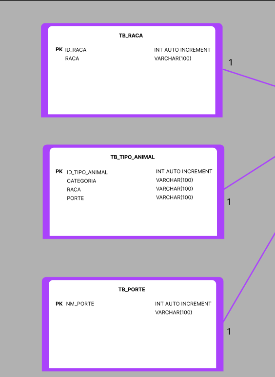
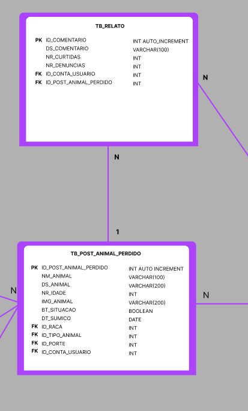
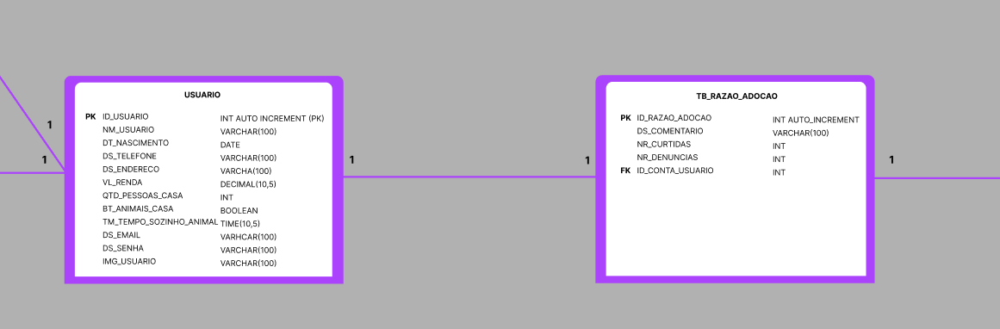
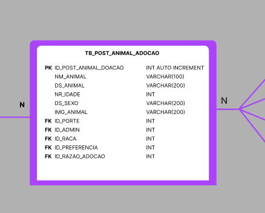
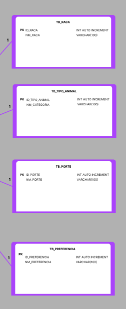
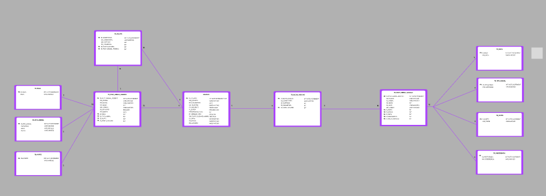
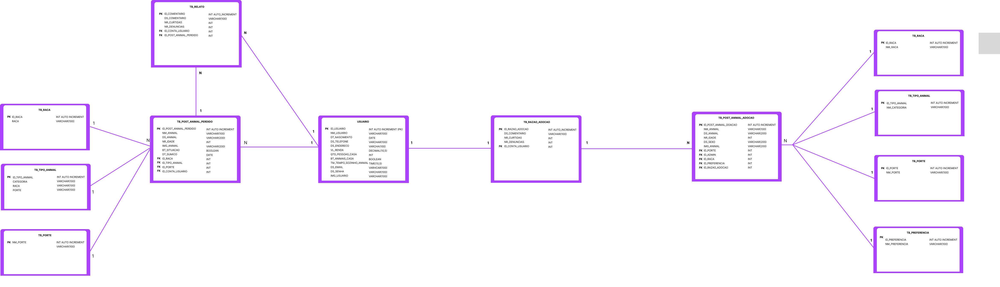

# Animal Side - Projeto Integrador 03

Este projeto integrador foi desenvolvido como parte do curso de Análise e Desenvolvimento de Sistemas (ADSD3). O sistema "Animal Side" é uma plataforma para facilitar a adoção de animais, oferecendo funcionalidades tanto para usuários quanto para administradores.

## Membros do Projeto

- **Gustavo Costa**
- **Laís Almeida**
- **Pietro dos Santos**

## Descrição do Projeto

O "Animal Side" é uma aplicação web que visa simplificar o processo de adoção de animais. Com ele, os usuários podem se cadastrar, gerenciar seus perfis, visualizar animais disponíveis para adoção e, eventualmente, adotar um animal. Administradores possuem permissões adicionais, como gerenciar o cadastro dos animais disponíveis para adoção.

## Funcionalidades

### Funcionalidades do Usuário

1. **Cadastro de Usuário:**
   - Usuários podem se registrar no sistema fornecendo seus dados pessoais.	

2. **Login:**
   - Usuários podem acessar o sistema com suas credenciais.

3. **Buscar Animais:**
   - Usuários podem procurar animais disponíveis para adoção ou perdidos no sistema.

4. **Cadastrar Animal Perdido:**
   - Usuários podem cadastrar um animal perdido, fornecendo detalhes e fotos.

5. **Fazer Comentários:**
   - Usuários podem comentar em postagens de animais ou em eventos.

6. **Adotar Animais:**
   - Usuários podem se candidatar para adotar um animal disponível no sistema.

7. **Fazer Doações em Dinheiro:**
   - Usuários podem realizar doações para apoiar a causa de adoção de animais.

8. **Editar Perfil:**
   - Usuários podem atualizar suas informações pessoais no sistema.

9. **Excluir/Editar Postagens:**
   - Usuários podem editar ou remover postagens que fizeram, como anúncios de animais perdidos.

10. **Atualizar Situação de Animal Perdido/Encontrado:**
    - Usuários podem marcar animais como "encontrados" ou "ainda perdido".

11. **Receber Comentários e Feedbacks:**
    - Usuários podem receber comentários e feedbacks de outros usuários e administradores.

### Funcionalidades do Administrador

1. **Dashboard Administrativo:**
   - Visualizar métricas gerais do sistema, como o número de adoções, doações, novos usuários, e denúncias.

2. **Login de Administrador:**
   - Administradores podem acessar o sistema com suas credenciais administrativas.

3. **Adicionar Animal para Adoção:**
   - Administradores podem cadastrar novos animais disponíveis para adoção, incluindo fotos e descrições.

4. **Editar/Excluir Cadastro de Animais:**
   - Administradores podem atualizar as informações dos animais ou removê-los do sistema.

5. **Visualizar e Gerenciar Postagens Denunciadas:**
   - Administradores podem visualizar postagens que foram denunciadas por usuários e tomar as devidas providências.

6. **Gerenciar Comentários:**
   - Administradores podem editar ou remover comentários inadequados.

7. **Adicionar/Editar/Excluir Eventos:**
   - Administradores podem criar eventos relacionados à adoção de animais, editá-los ou excluí-los.

8. **Receber e Gerenciar Doações:**
   - Administradores têm acesso para visualizar e gerenciar doações recebidas pelo sistema.

9. **Consultar Situação do Animal:**
   - Administradores podem acessar o histórico e a situação atual dos animais cadastrados no sistema.

10. **Enviar Feedback aos Usuários:**
    - Administradores podem fornecer feedback diretamente para os usuários do sistema.

11. **Gerenciar Usuários:**
    - Administradores podem visualizar, editar ou remover perfis de usuários do sistema.

## MODELO DE ENTIDADE RELACIONAL (MER)

## Telas Low Fidelity

1. **Home**
   

2. **A ONG**
   

3. **Quem Somos**
   

4. **Ajude**
   

5. **Feira**
   

6. **Feira Pop-Up**
   

7. **Adote**
   

8. **Adote Descrição**
   

9. **Adote Pop-Up**
   

10. **Coment.Adote**
   

11. **Coment.Adote Pop-Up**
   

12. **Doe**
   

13. **Doe Pagamento**
   

14. **Login**
   

15. **Cadastre-se**
   

16. **Login administrador**
   

17. **Perfil Usuário**
   

18. **Perfil Usuário Pop-Up**
   

19. **Post Usuário**
   

20. **Post Usuário Pop-Up alteração**
   

21. **Post Usuário Pop-Up excluir**
   

22. **Coment.Usuário**
   
   
23. **Feedbacks Usuário**
   

24. **Feedbacks Usuário Mensagem**
   

25. **Cadastro Animal perdido**
   

26. **Intereses**
   

27. **Perfil Administrador**
   

28. **Feed Adoção**
   

29. **Situação do bichinho**
   

30. **Feed Adoção Pop-Up excluir**
   

31. **Feed Adoção Pop-Up editar**
   

32. **Post**
   

33. **Post Pop-Up**
   

34. **Cadastra para Adoção**
   

35. **Denúncias**
   

36. **Denúncias Pop-Up excluir**
   

37. **Eventos**
   

38. **Cadastrar Evento**
   

39. **Dashboard**
   

40. **Feed procurar animal**
   

41. **Coment. Animal desaparecido**
   

42. **Denúnciar Post**
   

## Telas Alta Fidelidade

1. **Home**
   

2. **A ONG**
   

3. **Quem Somos**
   

4. **Ajude**
   

5. **Feira**
   

6. **Feira Pop-Up**
   

7. **Adote**
   

8. **Adote Descrição**
   

9. **Adote Pop-Up**
   

10. **Coment.Adote**
   

11. **Coment.Adote Pop-Up**
   

12. **Doe**
   

13. **Doe Pagamento**
   

14. **Login**
   

15. **Cadastre-se**
   

16. **Login administrador**
   

17. **Perfil Usuário**
   

18. **Perfil Usuário Infos**
   

19. **Perfil Usuário Pop-Up**
   

20. **Post Usuário**
   

21. **Post Usuário Pop-Up alteração**
   

22. **Post Usuário Pop-Up excluir**
   

23. **Post Usuário Pop-Up editar**
   

24. **Coment.Usuário**
   
   
25. **Feedbacks Usuário**
   

26. **Feedbacks Usuário Mensagem**
   

27. **Cadastro Animal perdido**
   

28. **Cadastro Animal perdido**
   

29. **Intereses**
   

30. **Intereses**
   

31. **Perfil Administrador**
   

32. **Feed Adoção**
   

33. **Situação do bichinho**
   

34. **Feed Adoção Pop-Up excluir**
   

35. **Feed Adoção Pop-Up editar**
   

36. **Post**
   

37. **Post Pop-Up**
   

38. **Cadastra para Adoção**
   

39. **Denúncias**
   

40. **Denúncias Pop-Up excluir**
   

41. **Eventos**
   

42. **Cadastrar Evento**
   

43. **Dashboard**
   

44. **Dashboard**
   

44. **Feed procurar animal**
   

45. **Coment. Animal desaparecido**
   

46. **Denúnciar Post**
   
